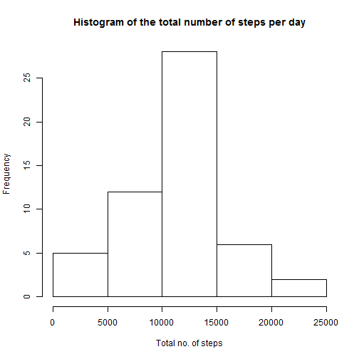
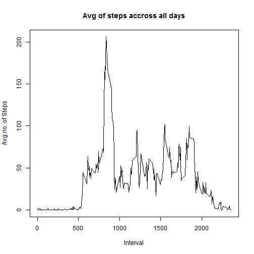
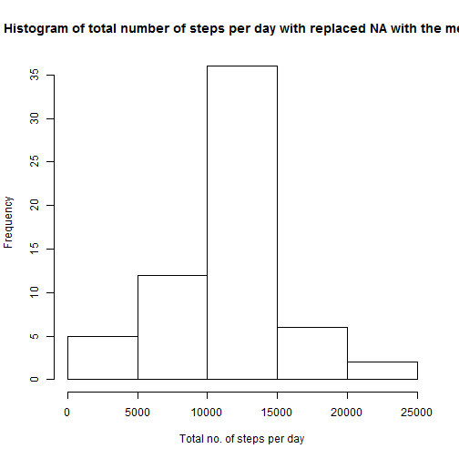
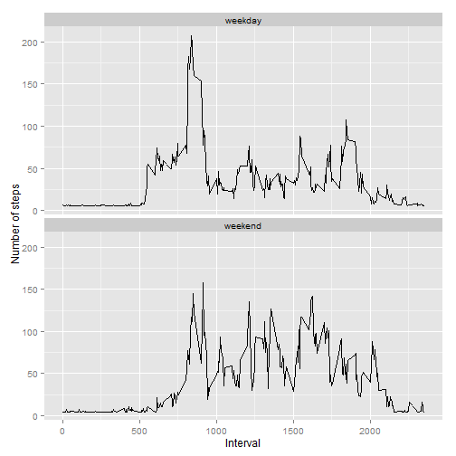

Prior answering the questions of the assignment, there are few steps are required to be executed as a preparation which will enable me to answer the questions.

I will first start with uploading the relevant libraries that we might use during developing the relevant code for the analysis.


```r
library(dplyr) ; library(knitr) ; library(ggplot2)
```

Thereafter, I will read the data and stored it into a variable, and do the needed processing to be ready for the analysis.


```r
file1<-read.csv("activity.csv",header=TRUE) %>% tbl_df
file<-filter(file1,!is.na(steps))
```

Now, we should be ready for the analysis part and answering the questions.

## What is mean total number of steps taken per day?

1. Calculate the total number of steps taken per day


```r
# summation of steps per day
file.sum.steps.day<-group_by(file,date) %>% summarize(sum(steps))
# print the 1st 10 row that shows the total number of steps taken per day.
head(file.sum.steps.day,10)
```

```
## Source: local data frame [10 x 2]
## 
##          date sum(steps)
##        (fctr)      (int)
## 1  2012-10-02        126
## 2  2012-10-03      11352
## 3  2012-10-04      12116
## 4  2012-10-05      13294
## 5  2012-10-06      15420
## 6  2012-10-07      11015
## 7  2012-10-09      12811
## 8  2012-10-10       9900
## 9  2012-10-11      10304
## 10 2012-10-12      17382
```


2. Make a histogram of the total number of steps taken each day


```r
# histogram
hist(file.sum.steps.day$"sum(steps)",nclass=6, main="Histogram of the total number of steps per day", xlab="Total no. of steps")
```

 

3. Calculate and report the mean and median of the total number of steps taken per day


```r
file.mean.sum.steps.day<-summary(file.sum.steps.day[2])[4]
file.median.sum.steps.day<-summary(file.sum.steps.day[2])[3]
```

Thus the mean of the total no. of steps is Mean   :10766   and the Median :10765  


## What is the average daily activity pattern?

1. Make a time series plot (i.e. type = "l") of the 5-minute interval (x-axis) and the average number of steps taken, averaged across all days (y-axis)


```r
# Calculate the average 
steps.interval<-aggregate(steps~interval,file,mean)
# Plot the outcome
plot(steps.interval$interval,steps.interval$steps,type="l",xlab="Interval",ylab="Avg.no. of Steps", main="Avg of steps accross all days")
```

 


2. Which 5-minute interval, on average across all the days in the dataset, contains the maximum number of steps?


```r
max.steps<-steps.interval[which.max(steps.interval$steps),]
max.steps
```

```
##     interval    steps
## 104      835 206.1698
```

The interval of 835 has the maximum average value of steps 206.1698113.

## Imputing missing values

1. Calculate and report the total number of missing values in the dataset (i.e. the total number of rows with NAs)


```r
total.no.missing.data<-nrow(file1)-nrow(file)
total.no.missing.data
```

```
## [1] 2304
```

The total no. of "NA" is 2304.


2. Devise a strategy for filling in all of the missing values in the dataset. I have filled the NA field with the mean of the steps. 


```r
file1[is.na(file1[1]),][1]<-mean(file$steps)
```


3. Create a new dataset that is equal to the original dataset but with the missing data filled in.


```r
head(file1,10)
```

```
## Source: local data frame [10 x 3]
## 
##      steps       date interval
##      (dbl)     (fctr)    (int)
## 1  37.3826 2012-10-01        0
## 2  37.3826 2012-10-01        5
## 3  37.3826 2012-10-01       10
## 4  37.3826 2012-10-01       15
## 5  37.3826 2012-10-01       20
## 6  37.3826 2012-10-01       25
## 7  37.3826 2012-10-01       30
## 8  37.3826 2012-10-01       35
## 9  37.3826 2012-10-01       40
## 10 37.3826 2012-10-01       45
```


4.a Make a histogram of the total number of steps taken each day and Calculate and report the mean and median total number of steps taken per day. 


```r
file1.sum.steps.day<-group_by(file1,date) %>% summarize(sum(steps))
# histogram
hist(file1.sum.steps.day$"sum(steps)",nclass=6,main="Histogram of total number of steps per day with replaced NA with the mean", xlab="Total no. of steps per day")
```

 


4.b Do these values differ from the estimates from the first part of the assignment? 


```r
file1.mean.sum.steps.day<-summary(file1.sum.steps.day[2])[4]
file1.median.sum.steps.day<-summary(file1.sum.steps.day[2])[3]

file1.mean.sum.steps.day ; file1.median.sum.steps.day
```

```
## [1] "Mean   :10766  "
```

```
## [1] "Median :10766  "
```

As we can see that there is no significant changes from imputing the missing data NA. as the mean value of the steps with and without the missing data is Mean   :10766   and Mean   :10766   respectively. The median value of the steps with and without the missing data is Median :10765   and Median :10766   respectively. Thus, the mean values are the same however, there is a light difference in the median.

## Are there differences in activity patterns between weekdays and weekends?

1. Create a new factor variable in the dataset with two levels - "weekday" and "weekend" indicating whether a given date is a weekday or weekend day


```r
# Converting the date into week day
file1<- mutate(file1,weekday=weekdays(as.Date(date)))

# Splittin the weekday into either weekend or weekday
file1$weekday[file1$weekday %in% c("Saturday","Sunday")]<-"weekend"
file1$weekday[file1$weekday !="weekend"]<-"weekday"
```

2. Make a panel plot containing a time series plot (i.e. type = "l") of the 5-minute interval (x-axis) and the average number of steps taken, averaged across all weekday days or weekend days (y-axis). See the README file in the GitHub repository to see an example of what this plot should look like using simulated data.


```r
file.mean.steps.per.day<-aggregate(steps ~ interval + weekday, file1, mean)
qplot(interval,steps,data=file.mean.steps.per.day,type="l",geom=c("line"),xlab="Interval", ylab="Number of steps")+facet_wrap(~ weekday,ncol=1)
```

 


